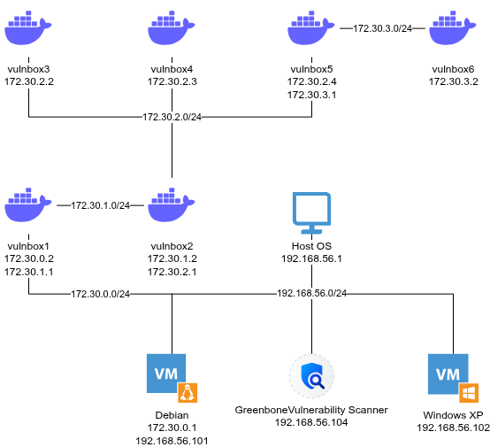

# Laboratory



## Debian
### Host OS - 192.168.56.101 172.30.0.1
| PORT      | STATE     | SERVICE       |
| ---       | ---       | ---           |
| 21/tcp    | open      | ftp           |
| 22/tcp    | open      | ssh           |
| 80/tcp    | open      | http          |
| 139/tcp   | open      | netbios-ssn   |
| 443/tcp   | open      | https         |
| 445/tcp   | open      | samba         |
| 514/tcp   | open      | syslog        |
| 631/tcp   | open      | cups          |
| 5432/tcp  | filtered  | postgresql    |
| 8000/tcp  | filtered  | http-alt      |
| 8080/tcp  | filtered  | http-proxy    |
| 137/udp   | open      | netbios-ns    |
| 514/udp   | open      | syslog        |
| 5353/udp  | open      | dns           |
#### List
```
T:20-22,T:80,T:514,T:139,T443-445,T:631,T:5432,T:8000,T:8080,
U:137,U:514,U:5353
```
### Docker Network
#### vulnbox1 - 172.30.0.2 172.30.1.1
| PORT      | STATE     | SERVICE       |
| ---       | ---       | ---           |
| 80/tcp    | open      | http          |
#### vulnbox2 - 172.30.1.2 172.30.2.1
| PORT      | STATE     | SERVICE       |
| ---       | ---       | ---           |
| 8080/tcp  | filtered  | http-proxy    |
#### vulnbox3 - 172.30.2.2
| PORT      | STATE     | SERVICE       |
| ---       | ---       | ---           |
| 80/tcp    | open      | http          |
#### vulnbox4 - 172.30.2.3
| PORT      | STATE     | SERVICE       |
| ---       | ---       | ---           |
| 22/tcp    | open      | ssh           |
#### vulnbox5 - 172.30.2.4 172.30.3.1
| PORT      | STATE     | SERVICE       |
| ---       | ---       | ---           |
| 139/tcp   | open      | netbios-ssn   |
| 445/tcp   | open      | samba         |
#### vulnbox6 - 172.30.3.2
| PORT      | STATE     | SERVICE       |
| ---       | ---       | ---           |
|3306/tcp   | open      |  mysql        |
#### List
```
T:22,T:80,T:139,T:445,T:3306,T:8080
```

## Windows XP
### 192.168.56.102
| PORT      | STATE             | SERVICE           |
| ---       | ---               | ---               |
| 7/tcp     | open              | echo              |
| 9/tcp     | open              | discard           |
| 13/tcp    | open              | daytime           |
| 17/tcp    | open              | qotd              |
| 19/tcp    | open              | chargen           |
| 21/tcp    | open              | ftp	            |
| 25/tcp    | open              | smtp              |
| 80/tcp    | open              | http              |
| 135/tcp   | open              | msrpc             |
| 139/tcp   | open              | netbios-ssn       |    
| 443/tcp   | open              | https             |
| 445/tcp   | open              | microsoft-ds      |    
| 1025/tcp  | open              | NFS-or-IIS        |    
| 1026/tcp  | open              | LSA-or-nterm      |    
| 1027/tcp  | open              | IIS               |
| 1032/tcp  | open              | iad3              |
| 1801/tcp  | open              | msmq              |
| 2103/tcp  | open              | zephyr-clt        |    
| 2105/tcp  | open              | eklogin           |
| 2107/tcp  | open              | msmq-mgmt         |    
| 5000/tcp  | open              | upnp              |
| 7/udp     | open              | echo              |
| 9/udp     | open\|filtered    | discard           |
| 13/udp    | open              | daytime           |
| 17/udp    | open              | qotd              |
| 19/udp    | open              | chargen           |
| 123/udp   | open              | ntp               |
| 135/udp   | open              | msrpc             |
| 137/udp   | open              | netbios-ns        |    
| 138/udp   | open\|filtered    | netbios-dgm       |    
| 161/udp   | open              | snmp              |
| 445/udp   | open\|filtered    | microsoft-ds      |    
| 500/udp   | open\|filtered    | isakmp            |
| 520/udp   | open\|filtered    | route             |
| 1028/udp  | open              | ms-lsa            |
| 1030/udp  | open              | iad1              |
| 1031/udp  | open\|filtered    | iad2              |
| 1900/udp  | open\|filtered    | upnp              |
| 3456/udp  | open\|filtered    | IISrpc-or-vat     |        
| 3527/udp  | open\|filtered    | beserver-msg-q    |
#### List
```
T:7-9,T:13,T:17-19,T:20-25,T:80,T:135,T:139,T:443-445,T:1025-1027,T:1032,T:1801,T:2103-2107,T:5000,
U:7-9,U:13,U:17-19,U:123,U:135-138,U:161,U:445,U:500,U:520,U:1028-1031,U:1900,U:3456,U:3527
```

## Full list
```
T:7-9,T:13,T:17-19,T:20-25,T:80,T:135,T:139,T:443-445,T:514,T:1025-1027,T:1032,T:1801,T:2103-2107,T:3306,T:8080,T:5000,
U:7-9,U:13,U:17-19,U:123,U:135-138,U:161,U:445,U:500,U:514,U:520,U:1028-1031,U:1900,T:3306,U:3456,U:3527,U:5353
```
